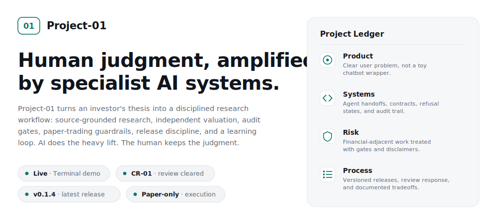
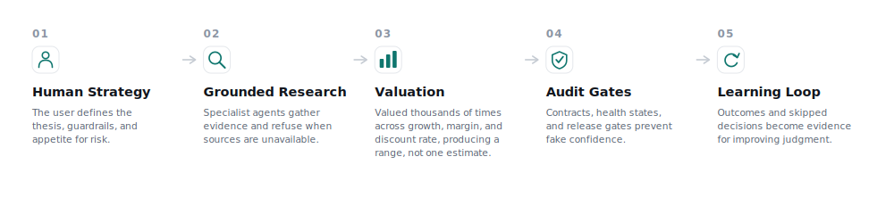
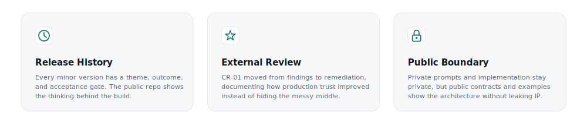

<picture>
  <source media="(prefers-color-scheme: dark)" srcset=".github/assets/hero-dark.svg">
  
</picture>

<picture>
  <source media="(prefers-color-scheme: dark)" srcset=".github/assets/workflow-dark.svg">
  
</picture>

<picture>
  <source media="(prefers-color-scheme: dark)" srcset=".github/assets/pillars-dark.svg">
  
</picture>

**Live:** https://project-01-terminal.vercel.app

---

## What It Is

Serious investment research has always been gated behind a seven-figure desk: a room of analysts, data terminals, a quant team. Project-01 puts that desk behind one login.

Not a signals service. Not a black box. Not a chatbot dressed up as a research tool. Project-01 is six specialized AI agents working in sequence before you decide. The fundamental analyst forms a view from the filing before touching the news, and values the company as a distribution of thousands of simulated futures (growth, margins, discount rates) rather than a single number. The quant validates whether the thesis holds in the data. The auditor checks the numbers before anything reaches you. Research that would take a team half a day, delivered in seconds, with the full reasoning chain intact.

For investors who want to take positions with the same depth of conviction a professional fund would require: this is the tool.

---

## How It Works

**TERMINAL** - Pull up any ticker and get the complete picture on one screen.

Price action with annotated events. Options flow and unusual activity. Insider and institutional moves. A peer comparison that shows where this company stands in its cohort. A fundamental verdict with an intrinsic-value range and risk flags. Everything you would want before making a decision - already pulled, already structured, already ranked by what matters most.

**STRATEGY** - Define your investment criteria once. The system executes against them.

Set the universe of stocks to watch. Set entry conditions: what a company needs to look like before you'd consider it. Set exit conditions. Set hard limits on position size, drawdown, and sector exposure. The system monitors every stock in your universe, flags when your criteria are met, and executes trades within your guardrails - only when you've authorized it to.

This is not automated trading that replaces judgment. It is systematic execution of judgment you have already expressed. The investor defines the rules. The system enforces them with the consistency a human cannot maintain at 3 AM when a position moves.

**COCKPIT** - When the system is executing on your behalf, you see everything in real time.

Every position. Every decision made and the rationale behind it. Every risk limit and how close you are to it. A glass box, not a black box.

---

## Vision

https://project-01-terminal.vercel.app/vision

---

## Release History

Project-01 ships under a versioned release discipline. Every minor version carries a single-purpose theme, a list of outcomes, and a record of the gates that passed before merge.

- **[v0.1.4](./RELEASES/v0.1.4.md)** - 2026-05-14. Earnings-quality letter-grade band shipped. Cross-name calibration broadened to five tickers. Eight-name historical-fraud forensic fixture passes 8/8.
- **[v0.1.3](./RELEASES/v0.1.3.md)** - 2026-05-14. Distributional intrinsic-value band shipped. Four-tier conviction ladder. Dual-layer capital-exposure discipline.
- **[v0.1.2](./RELEASES/v0.1.2.md)** - 2026-05-12. External code review response; all findings closed; production-trust verdict moved to GO.
- Full timeline: [`CHANGELOG.md`](./CHANGELOG.md)
- Long-form release notes: [`RELEASES/`](./RELEASES/)
- Where the project actually stands: [`STATUS.md`](./STATUS.md)

---

## Get in Touch

The build is ongoing. If something here caught your attention, you know where to find me.

[github.com/PranavOngole](https://github.com/PranavOngole)

---

## Disclaimer

This platform is for informational and educational purposes only.
Nothing produced by Project-01 constitutes financial advice, investment advice,
or a recommendation to buy or sell any security.
Always conduct your own due diligence and consult a qualified financial professional
before making investment decisions.
Past performance of any security referenced is not indicative of future results.
